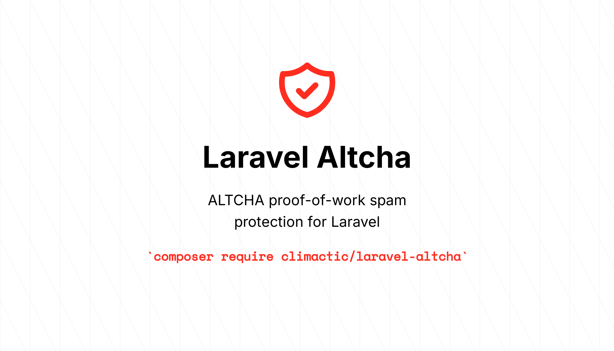

<div align="center">



# Laravel Altcha

Drop-in [ALTCHA](https://altcha.org) proof-of-work spam protection for Laravel. Privacy-first, self-hosted, no third-party services, no tracking — just a middleware, a validation rule, and a challenge endpoint.

[](https://discord.gg/kedWdzwwR5)
[](https://packagist.org/packages/climactic/laravel-altcha)
[](https://github.com/climactic/laravel-altcha/actions?query=workflow%3Arun-tests+branch%3Amain)
[](https://github.com/climactic/laravel-altcha/actions?query=workflow%3A"Fix+PHP+code+style+issues"+branch%3Amain)
[](https://packagist.org/packages/climactic/laravel-altcha)
[](https://github.com/sponsors/climactic)
[](https://ko-fi.com/ClimacticCo)
</div>

## 📖 Table of Contents

- [Laravel Altcha](#laravel-altcha)
  - [📖 Table of Contents](#-table-of-contents)
  - [Features](#features)
  - [🌟 Sponsors](#-sponsors)
  - [📦 Installation](#-installation)
  - [⚙️ Configuration](#️-configuration)
    - [Environment Variables](#environment-variables)
    - [Algorithms](#algorithms)
  - [🚀 Usage](#-usage)
    - [🛡️ Middleware](#️-middleware)
    - [✅ Validation Rule](#-validation-rule)
    - [🎯 Challenge Endpoint](#-challenge-endpoint)
    - [🧩 Frontend Integration](#-frontend-integration)
      - [React (Inertia) stubs](#react-inertia-stubs)
      - [Other frameworks](#other-frameworks)
    - [🔁 Replay Prevention](#-replay-prevention)
    - [🧮 Custom Verification](#-custom-verification)
  - [📚 API Reference](#-api-reference)
    - [🔧 Classes](#-classes)
    - [🧠 Middleware Behavior](#-middleware-behavior)
    - [🧾 Verifier Reasons](#-verifier-reasons)
  - [🧪 Testing](#-testing)
  - [📋 Changelog](#-changelog)
  - [🤝 Contributing](#-contributing)
  - [🔒 Security Vulnerabilities](#-security-vulnerabilities)
  - [💖 Support This Project](#-support-this-project)
  - [⭐ Star History](#-star-history)
  - [📦 Other Packages](#-other-packages)
  - [📄 License](#-license)
  - [⚖️ Disclaimer](#️-disclaimer)

## Features

- 🛡️ **Drop-in middleware** — protect any POST route with a single `altcha` alias
- ✅ **Validation rule** — use `new Altcha()` in FormRequests and inline validators
- 🎯 **Auto-registered challenge endpoint** — `GET /altcha` works out of the box, fully customizable
- 🔁 **Replay prevention** — challenges are single-use, cached by signature
- 🔀 **Pluggable algorithms** — PBKDF2, Argon2id, or Scrypt
- ⚡ **Optional fast verification** — skip re-derivation with a secondary HMAC key
- 🧩 **Framework-agnostic frontend** — React/TypeScript stubs shipped; any framework supported via the `altcha` web component
- 🌐 **i18n-friendly** — all user-facing messages routed through `__()`
- 🧪 **Tested** — 14 feature tests across middleware, rule, and endpoint
- 🔒 **Privacy-first** — no cookies, no fingerprinting, no third-party calls, GDPR/HIPAA/CCPA compliant

Built on [`altcha-org/altcha`](https://github.com/altcha-org/altcha-lib-php) v2 (PoW v2).

## 🌟 Sponsors

<!-- sponsors -->
*Your logo here* — Become a sponsor and get your logo featured in this README and on our website.
<!-- sponsors -->

**Interested in title sponsorship?** Contact us at [sponsors@climactic.co](mailto:sponsors@climactic.co) for premium placement and recognition.

## 📦 Installation

Install the package via Composer:

```bash
composer require climactic/laravel-altcha
```

Publish the config:

```bash
php artisan vendor:publish --tag="laravel-altcha-config"
```

Add the required env vars:

```env
ALTCHA_ENABLED=true
ALTCHA_HMAC_SECRET=<long-random-string>
```

> 💡 Generate a strong secret with `php -r "echo bin2hex(random_bytes(32));"`.

## ⚙️ Configuration

The published `config/altcha.php` exposes everything you might want to tune:

```php
return [
    'enabled' => (bool) env('ALTCHA_ENABLED', false),
    'hmac_secret' => env('ALTCHA_HMAC_SECRET'),
    'hmac_key_secret' => env('ALTCHA_HMAC_KEY_SECRET'),
    'algorithm' => env('ALTCHA_ALGORITHM', 'pbkdf2'),
    'cost' => (int) env('ALTCHA_COST', 10000),
    'expires' => (int) env('ALTCHA_EXPIRES', 300),
    'memory_cost' => ...,
    'parallelism' => ...,
    'cache_store' => env('ALTCHA_CACHE_STORE'),
    'field' => env('ALTCHA_FIELD', 'altcha'),
    'route' => [
        'enabled' => true,
        'path' => 'altcha',
        'name' => 'altcha.challenge',
        'prefix' => '',
        'domain' => null,
        'middleware' => ['web'],
    ],
];
```

### Environment Variables

| Key | Env | Default | Notes |
|---|---|---|---|
| `enabled` | `ALTCHA_ENABLED` | `false` | Master switch. When false, middleware and rule pass-through and the endpoint returns 404. |
| `hmac_secret` | `ALTCHA_HMAC_SECRET` | — | **Required** when enabled. Used to sign challenges. |
| `hmac_key_secret` | `ALTCHA_HMAC_KEY_SECRET` | `null` | Optional. Enables the fast verification path (skips re-derivation). |
| `algorithm` | `ALTCHA_ALGORITHM` | `pbkdf2` | `pbkdf2`, `argon2id`, or `scrypt`. |
| `cost` | `ALTCHA_COST` | `10000` | PoW iterations / time cost. Higher = harder for bots. |
| `expires` | `ALTCHA_EXPIRES` | `300` | Challenge lifetime in seconds. Also used as the replay cache TTL. |
| `memory_cost` | `ALTCHA_MEMORY_COST` | `null` | Argon2id / Scrypt only. |
| `parallelism` | `ALTCHA_PARALLELISM` | `null` | Scrypt only. |
| `cache_store` | `ALTCHA_CACHE_STORE` | default | Cache store used for replay prevention. |
| `field` | `ALTCHA_FIELD` | `altcha` | Request field name the middleware/rule read from. |
| `route.enabled` | `ALTCHA_ROUTE_ENABLED` | `true` | Disable to register the endpoint yourself. |
| `route.path` | `ALTCHA_ROUTE_PATH` | `altcha` | Challenge endpoint path. |
| `route.name` | `ALTCHA_ROUTE_NAME` | `altcha.challenge` | Route name for `route()` helpers. |
| `route.prefix` | `ALTCHA_ROUTE_PREFIX` | `''` | Route group prefix. |
| `route.domain` | `ALTCHA_ROUTE_DOMAIN` | `null` | Route group domain. |

### Algorithms

| Algorithm | Extension | When to use |
|---|---|---|
| `pbkdf2` | built-in | Default. Works everywhere. Good baseline. |
| `argon2id` | `ext-sodium` | Strongest. Memory-hard — resistant to ASIC/GPU acceleration. |
| `scrypt` | [`php-scrypt`](https://github.com/DomBlack/php-scrypt) | Memory-hard alternative. |

## 🚀 Usage

### 🛡️ Middleware

Protect any POST route with the `altcha` middleware alias:

```php
use Illuminate\Support\Facades\Route;

Route::post('/contact', ContactController::class)->middleware('altcha');
Route::post('/register', RegisterController::class)->middleware('altcha');
```

Works inside a middleware group too:

```php
Route::middleware(['web', 'altcha'])->group(function () {
    Route::post('/enterprise', EnterpriseController::class);
    Route::post('/waitlist', WaitlistController::class);
});
```

Failed verifications throw a `ValidationException` with an error on the `altcha` field — so Inertia/Blade forms display the error like any other validation failure.

### ✅ Validation Rule

For FormRequests and inline validators:

```php
use Climactic\Altcha\Rules\Altcha;

public function rules(): array
{
    return [
        'email' => ['required', 'email'],
        'altcha' => [new Altcha()],
    ];
}
```

The rule is **implicit** — it runs even when the field is empty, so you don't need `required` unless you want its error message. When `altcha.enabled` is false, it passes silently.

### 🎯 Challenge Endpoint

`GET /altcha` is registered automatically and returns a signed challenge:

```json
{
    "parameters": {
        "algorithm": "pbkdf2",
        "salt": "...",
        "cost": 10000
    },
    "signature": "..."
}
```

Customize via `config/altcha.php` — path, prefix, domain, and middleware group are all tunable. Set `route.enabled` to `false` and register the controller yourself if you need full control:

```php
use Climactic\Altcha\Http\Controllers\AltchaChallengeController;

Route::get('/security/challenge', AltchaChallengeController::class)
    ->middleware(['web', 'throttle:60,1']);
```

### 🧩 Frontend Integration

Install the ALTCHA web component:

```bash
npm install altcha
```

#### React (Inertia) stubs

Publish the TypeScript wrappers:

```bash
php artisan vendor:publish --tag="altcha-frontend"
```

This copies:

- `resources/js/components/altcha-widget.tsx` — React wrapper around the web component
- `resources/js/types/altcha.d.ts` — JSX types for `<altcha-widget>`

Then use it in any form:

```tsx
import { AltchaWidget } from '@/components/altcha-widget';

export default function ContactForm() {
    return (
        <form method="post" action="/contact">
            <input name="email" type="email" required />
            <textarea name="message" required />

            <AltchaWidget challengeUrl="/altcha" />

            <button type="submit">Send</button>
        </form>
    );
}
```

The widget solves the challenge in a web worker and injects the solution into a hidden `altcha` input at submit time — totally invisible to your users.

#### Other frameworks

Vue, Svelte, Solid, Lit, Alpine, and plain HTML work out of the box with the `altcha` npm package — no wrapper needed:

```html
<altcha-widget challengeurl="/altcha" auto="onsubmit" floating="bottom"></altcha-widget>
```

See the official [framework starters](https://github.com/altcha-org?q=altcha-starter) for idiomatic integrations.

### 🔁 Replay Prevention

Every valid solution is recorded in the cache using the challenge signature as the key. A second submission of the same payload fails with a replay error:

```text
Security challenge has already been used. Please try again.
```

The record TTL equals `altcha.expires` (so entries self-expire when the challenge itself would have). Use the `cache_store` config to isolate this from your application's default cache.

### 🧮 Custom Verification

Need to verify outside the middleware/rule (e.g. an API controller, a queued job)? Resolve the `Verifier`:

```php
use Climactic\Altcha\Support\Verifier;

$result = app(Verifier::class)->verify($request->input('altcha'));

if (! $result->verified) {
    return response()->json([
        'error' => 'captcha',
        'reason' => $result->reason, // missing | malformed | invalid | expired | replay
    ], 422);
}
```

## 📚 API Reference

### 🔧 Classes

| Class | Purpose |
|---|---|
| `Climactic\Altcha\Http\Middleware\VerifyAltcha` | Middleware registered under the `altcha` alias. |
| `Climactic\Altcha\Http\Controllers\AltchaChallengeController` | Invokable controller backing `GET /altcha`. |
| `Climactic\Altcha\Rules\Altcha` | Implicit `ValidationRule` implementation. |
| `Climactic\Altcha\Support\Verifier` | Core verification service. Resolvable from the container. |
| `Climactic\Altcha\Support\VerificationResult` | Immutable result value object (`verified`, `reason`, `replayKey`). |
| `Climactic\Altcha\Support\AlgorithmFactory` | Produces a `DeriveKeyInterface` for the configured algorithm. |

### 🧠 Middleware Behavior

`VerifyAltcha` intentionally bypasses verification in a few cases so you can apply it broadly without extra logic:

| Condition | Outcome |
|---|---|
| `altcha.enabled` is `false` | Pass-through |
| Request method is not POST | Pass-through |
| User is authenticated | Pass-through |
| Missing/invalid payload | `ValidationException` on the `altcha` field |
| Valid payload | Marked used, request continues |

### 🧾 Verifier Reasons

`VerificationResult::$reason` is one of:

| Constant | String | Meaning |
|---|---|---|
| `Verifier::REASON_MISSING` | `missing` | No payload was submitted. |
| `Verifier::REASON_MALFORMED` | `malformed` | Payload wasn't valid base64 / JSON / shape. |
| `Verifier::REASON_INVALID` | `invalid` | Signature or derived key didn't match. |
| `Verifier::REASON_EXPIRED` | `expired` | Challenge passed `expiresAt`. |
| `Verifier::REASON_REPLAY` | `replay` | Payload was already accepted once. |

## 🧪 Testing

```bash
composer test
```

Type check + lint:

```bash
composer analyse
composer format
```

## 📋 Changelog

Please see [CHANGELOG](CHANGELOG.md) for more information on what has changed recently.

## 🤝 Contributing

Please see [CONTRIBUTING](CONTRIBUTING.md) for details.
You can also join our Discord server to discuss ideas and get help: [Discord Invite](https://discord.gg/kedWdzwwR5).

## 🔒 Security Vulnerabilities

Please report security vulnerabilities to [security@climactic.co](mailto:security@climactic.co).

## 💖 Support This Project

Laravel Altcha is free and open source, built and maintained with care. If this package helps keep spam off your forms or saves you a Cloudflare Turnstile bill, please consider supporting its continued development.

<a href="https://github.com/sponsors/climactic">
    
</a>
&nbsp;
<a href="https://ko-fi.com/ClimacticCo">
    
</a>

## ⭐ Star History

[](https://www.star-history.com/#climactic/laravel-altcha&type=date&legend=top-left)

## 📦 Other Packages

Check out our other Laravel packages:

| Package | Description |
| ------- | ----------- |
| 🛡️ [laravel-spam](https://github.com/climactic/laravel-spam) | Anti-spam toolkit: disposable-email and blocklist rules, StopForumSpam lookups, middleware, and a check API. Pairs naturally with Laravel Altcha. |
| 💳 [laravel-credits](https://github.com/climactic/laravel-credits) | Ledger-based credit system for virtual currencies, reward points, and credit-based features, with transfers, metadata querying, and historical balances. |
| 🧾 [laravel-polar](https://github.com/climactic/laravel-polar) | [Polar.sh](https://polar.sh) billing integration for Laravel — subscriptions, one-off purchases, webhooks, and license keys. |

## 📄 License

The MIT License (MIT). Please see [License File](LICENSE) for more information.

## ⚖️ Disclaimer

This package is not affiliated with Laravel or ALTCHA. It's for Laravel but is not by Laravel. Laravel is a trademark of Taylor Otwell. ALTCHA is a trademark of [Daniel Regeci / ALTCHA](https://altcha.org).
